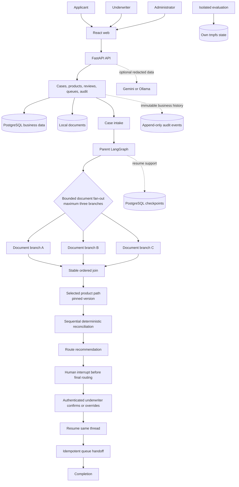

# UnderwriteFlow

Local, human-governed triage demonstration for fictional motor, life, and
health applications. It turns application details and evidence into an
evidence-backed work-queue recommendation for human review.

The local MVP uses FastAPI, LangGraph, React, PostgreSQL, and Docker Compose.

UnderwriteFlow recommends a work queue route. An authenticated underwriter
must confirm or override every final route. It never approves, declines,
binds, prices, issues, renews, or cancels insurance.

## On this page

- [What this demonstrates](#what-this-demonstrates)
- [Quickstart](#quickstart-local-fake-provider)
- [Environment mode startup paths](#environment-mode-startup-paths)
- [Role verification](#verify-each-role)
- [Automated checks](#automated-verification)
- [Architecture](#architecture-overview)
- [Evaluation](#environments-and-evaluation-data)
- [Reset local demonstration](#reset-local-demonstration)
- [Troubleshooting](#troubleshooting)
- [Known limits](#known-limits)

## What this demonstrates

UnderwriteFlow demonstrates how fictional applications and evidence can become
an evidence-backed triage recommendation. It supports expedited, standard, and
specialist review as work-queue routes—not insurance decisions.

It also demonstrates versioned product rules, deterministic evidence checks,
human review, immutable audit history, and isolated synthetic evaluation. Only
fictional data belongs in this local demonstration.

## Implemented features

| Capability | Demonstrated behavior | Boundary |
| --- | --- | --- |
| Intake | New business or renewal | Fictional data only |
| Versioned rules | Admin validates and activates rules | Cases stay pinned |
| Reconciliation | Finds evidence conflicts or gaps | Deterministic checks |
| Triage and review | Underwriter confirms a route | No insurance decision |
| Audit history | Preserves business events | Checkpoints support resume |
| Safe evaluation | Isolated 90-case run | No shared development state |

### Journeys and product authoring

Applicants choose new business or renewal before selecting a product; a
renewal requires its prior-policy document before the rest of the form.
Administrators author, preview, and version product rulebooks (fields,
documents, routing rules, reconciliation checks) through the builder, then
explicitly activate one version per product. A case stays pinned to the
version and journey selected when it started.

`make evaluate-e2e` runs the full 90-case synthetic evaluation set against an
isolated, tmpfs-only Compose stack with no published ports and no shared
state with the development database or upload volume.

### Provider boundary

The default generation provider is Gemini, so extracted document content and
application facts are sent to the Gemini API unless the fake provider is
selected. Set `GENERATION_PROVIDER=fake` to keep synthetic data on this
machine. Ollama is available through the `ollama` Compose profile.

Uploads are validated from their bytes, and file metadata is stored in the
local upload volume. Uploaded content is untrusted and is never treated as
model instructions.

LangSmith tracing is disabled by default. To opt in for synthetic evaluation,
set `LANGSMITH_TRACING=true`, provide a local evaluation key, and use the
APAC endpoint in `.env.example`. Trace payloads are redacted and tracing
failures never change application behavior.

## Quickstart: local fake provider

Use the deterministic fake provider for a no-credential local demonstration.
It keeps synthetic application and document content on this machine.

```bash
cp .env.example .env
# Edit .env: set GENERATION_PROVIDER=fake
docker compose up --build
```

### Gemini provider: approved project

Use Gemini only with an approved project configured for no training or
retention of request and response data. Put values in local `.env` only. Never
paste an API key into this README, a command, or shell history.

```bash
cp .env.example .env
# Edit .env: set GENERATION_PROVIDER=gemini
# Edit .env: set GEMINI_NO_TRAINING_ACKNOWLEDGED=true after approval
docker compose up --build
```

`.env.example` lists required fields: `GEMINI_API_KEY`, `GEMINI_MODEL`,
`GEMINI_NO_TRAINING_ACKNOWLEDGED`, `PROVIDER_ALLOWED_HOSTS`, and
`PII_REDACTION_TERMS`. Keep the approved Gemini host in the allowlist. Set
redaction terms for deployment-specific identifiers before any request.
Only approved, redacted synthetic task data may leave the local boundary.

Without an approved project or credential, keep `GENERATION_PROVIDER=fake`.
The fake path needs no cloud credential and remains the default for local
checks.

## Environment mode startup paths

Choose one path before starting the stack. Every path uses fictional data.

### Development: normal local demonstration

Use development for interactive local work. It uses isolated local Compose
state. Set the fake provider to avoid cloud credentials:

```bash
cp .env.example .env
# Edit .env: set ENVIRONMENT_MODE=development
# Edit .env: set GENERATION_PROVIDER=fake
docker compose up --build
```

Development starts the normal local stack. It does not load evaluation cases
automatically. The fake provider keeps application and document content local.

### Evaluation: isolated synthetic run

Use evaluation for the 90-case synthetic reference run. The isolated Compose
file sets `ENVIRONMENT_MODE=evaluation`, uses the fake provider, and keeps its
database, uploads, network, and result state separate from development:

```bash
make evaluate-e2e
```

The command starts `compose.evaluation.yaml`, runs the evaluation runner, and
cleans up its containers. Expected result: the deterministic 90-case
evaluation passes; failures return a nonzero exit. It does not share
development state.

### Production: guarded configuration mode

Use production only to validate configuration behavior. This override sets
`ENVIRONMENT_MODE=production` and refuses evaluation loading. It makes no
production-readiness, security, or compliance claim:

```bash
docker compose -f compose.yaml -f compose.production.yaml up --build
```

Open `http://localhost:5173`. PostgreSQL is reachable only on the Compose
network by default. To use host database tools, opt in explicitly:

```bash
# Default: no published database port
# Opt in to a localhost-only port for host tools
docker compose -f compose.yaml -f compose.localhost.yaml up --build
```

The Compose bootstrap applies migrations and imports the three product files.
The migration provisions fictional Applicant, Underwriter, and Administrator
accounts.

### Fictional demo accounts

These credentials are public demonstration values. Never use them outside a
local synthetic environment.

- Applicant: `applicant@synthetic.test`
  `underwriteflow-demo-applicant`
- Underwriter: `underwriter@synthetic.test`
  `underwriteflow-demo-underwriter`
- Administrator: `administrator@synthetic.test`
  `underwriteflow-demo-administrator`

## Verify each role

1. **Administrator**: Open Product Configuration and activate one fictional
   product version. Confirm applicants can select it, inspect the case audit,
   then run `make evaluate-e2e` and confirm the isolated run cleans up.
2. **Applicant**: Start new business or renewal, upload only synthetic
   evidence, and submit. A renewal requires prior-policy evidence first.
3. **Underwriter**: Open submitted case from queue, inspect evidence, then
   confirm recommendation or override it with a reason.

The case completes only after underwriter confirmation. For a fuller guided
walkthrough, see the [demo guide](docs/DEMO.md).

## Automated verification

Run these from repository root with Docker Compose available:

- `make test-api`: deterministic API tests and reconciliation coverage pass.
- `make test-web`: the web suite passes.
- `make smoke`: synthetic intake, review, and completion pass.
- `make evaluate-e2e`: isolated 90-case evaluation passes, then cleans up.

```bash
make test-api
make test-web
make smoke
make evaluate-e2e
```

## Architecture overview



Solid arrows show sequential stages. The fan-out runs bounded parallel
document work, then the join waits for successful branches before the selected
product path continues. Checkpoints support resume after interruption; they do
not replace immutable audit events as the business history. No route completes
until an authenticated underwriter confirms or overrides the recommendation.

### Case lifecycle

1. An applicant submits fictional details and supporting evidence.
2. The case pins its selected journey and product version.
3. The workflow extracts evidence and runs deterministic reconciliation.
4. It recommends expedited, standard, or specialist review as a queue route.
5. An authenticated underwriter inspects the evidence and confirms or overrides
   the route.
6. The decision and supporting process history are recorded in the audit trail.

### Component responsibilities

| Area | Responsibility | Boundary |
| --- | --- | --- |
| Web interface | Role-based interaction | No underwriting rules |
| Workflow | Evidence checks and recommendation | No final route |
| Storage | Cases, versions, audit, checkpoints | Local source of truth |
| Provider | Optional redacted assistance | Not an authority |
| Evaluation | Isolated synthetic validation | No shared development state |

See the [architecture guide](docs/ARCHITECTURE.md) for full component detail.

### Safety and extension boundaries

- Uploads are untrusted evidence, never model instructions.
- New cases pin their selected product version and journey.
- Deterministic rules outrank model suggestions and retain evidence provenance.
- Gemini receives redacted task data; fake provider supports local checks.
- Audit events preserve history; workflow checkpoints only support resume.
- Only an authenticated underwriter confirms or overrides a final route.
- Extend products through versioned configuration and existing provider
  adapters. Do not bypass with direct provider calls or hard-coded rules.

## Environments and evaluation data

Every environment starts with schema, permissions, fictional demo accounts,
and built-in product versions. Startup creates no cases, documents, or
recommendations.

`ENVIRONMENT_MODE` selects `development`, `evaluation`, or `production`.
Development is local default. Evaluation runs isolated storage. Production is
an environment setting only, not a production-readiness or compliance claim.

Evaluation data never loads at startup. An authorized operator can explicitly
load the 90-case synthetic corpus into development or evaluation. The loader
is idempotent, retry-safe, uses the fake provider, and never confirms a route.
See `specs/004-environment-data-seeding/quickstart.md` for loader commands
and expected results.

`make evaluate-e2e` runs the same corpus in an isolated, tmpfs-backed stack
with no shared development state. Production rejects evaluation loading before
database or upload access with `evaluation_load_forbidden`.

All applicants, documents, rules, and evaluation cases are fictional.

## Reset local demonstration

Use this reset only for a local stack containing fictional data. Stop the
development stack first. The reset permanently removes the development
database and uploaded synthetic files. Do not use it for production data or
records that need retention.
This is not a production recovery or retention procedure.

**Warning:** The command below cannot recover deleted cases, documents,
reviews, or audit history. Confirm that all local data may be erased before
running it.

```bash
docker compose down
docker volume rm underwriteflow_postgres_data underwriteflow_uploads_data
docker compose up --build
```

This removes only the `postgres_data` and `uploads_data` volumes. It preserves
unrelated volumes, including web dependencies and optional Ollama data. Do
not replace these commands with `docker compose down -v`.

Startup reruns migrations and product bootstrap. Verify the empty fictional
baseline: demo accounts and built-in product versions exist, while prior
cases, uploaded documents, reviews, and audit records do not.

## Troubleshooting

- **Stack is not ready**: run `docker compose ps`, then inspect
  `docker compose logs bootstrap api`.
- **Sign-in fails**: wait for bootstrap to finish, then select the matching
  fictional account above or re-enter its listed credentials.
- **No product is selectable**: sign in as Administrator and activate a
  fictional product version before creating an application.
- **An automated check fails**: run it from repository root, review its output,
  then inspect `docker compose logs api web` for running-service failures.
- **Local provider needs credentials**: set `GENERATION_PROVIDER=fake` for the
  deterministic, no-credential path.
- **Evaluation load is denied**: use development or evaluation with a current
  `evaluation:run` token. Production always refuses evaluation loading.

## Known limits

- This is a local, single-node demonstration: it has no broker, scheduler, or
  object storage.
- It uses fictional data only and is not a production-readiness or compliance
  claim.
- Normal checks use the fake provider, so live-provider latency, cost, and
  quota behaviour are untested.
- Uploads are validated but have no malware scan or quarantine. Real-user
  deployments need both before accepting uploads.
- Tracing is off by default. No retention or deletion policy exists beyond the
  append-only audit guarantee.

## Further reading

- [Product requirements](docs/PRD.md)
- [Finalized MVP decisions](docs/PRD_FINALIZED_DECISIONS.md)
- [Implementation plan](docs/IMPLEMENTATION_PLAN.md)
- [Architecture](docs/ARCHITECTURE.md)
- [Demo guide](docs/DEMO.md)
- [Evaluation loader](specs/004-environment-data-seeding/quickstart.md)
- [Release readiness](docs/RELEASE_READINESS.md)
- [Synthetic evaluation set](evaluation/cases.json)
- [UI prototype](designs/underwriteflow-ui/index.html)

All applicants, documents, organizations, product rules, and evaluation cases
are synthetic and intended only for demonstration.
