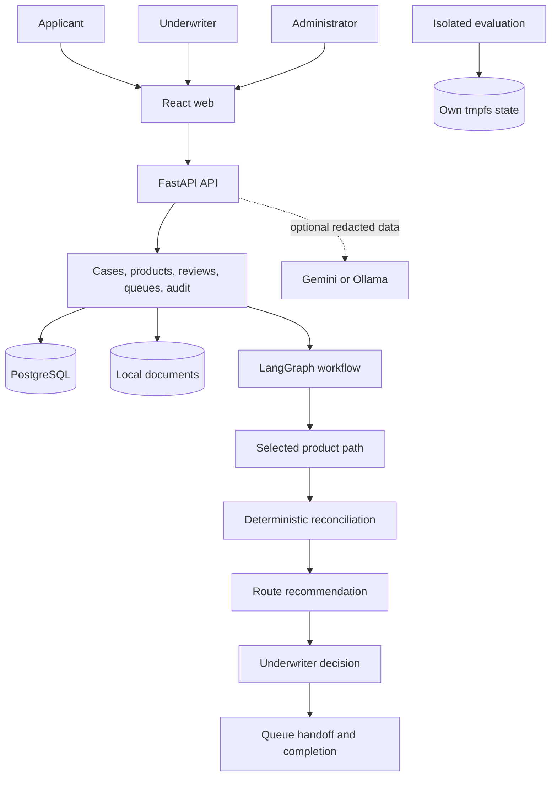

# UnderwriteFlow

Local, human-governed triage demonstration for fictional motor, life, and
health applications. It turns application details and evidence into an
evidence-backed work-queue recommendation for human review.

The local MVP uses FastAPI, LangGraph, React, PostgreSQL, and Docker Compose.

UnderwriteFlow recommends a work queue route. An authenticated underwriter
must confirm or override every final route. It never approves, declines,
binds, prices, issues, renews, or cancels insurance.

## Implemented features

- **Journey-aware intake**: Applicants choose new business or renewal before
  product selection; renewal can require prior-policy evidence.
- **Versioned product authoring**: Administrators validate, preview, compare,
  activate, and export fictional product rulebooks. Existing cases stay pinned.
- **Evidence reconciliation**: Configured checks identify cleared, conflicting,
  or missing evidence with document provenance.
- **Human review and audit**: Deterministic rules recommend a route; an
  underwriter confirms it. Immutable audit events preserve decision history.
- **Safe evaluation**: Development and evaluation can load synthetic data on
  demand. Isolated 90-case evaluation never shares development state.

### Journeys and product authoring

Applicants choose new business or renewal before selecting a product; a
renewal requires its prior-policy document before the rest of the form.
Administrators author, preview, and version product rulebooks (fields,
documents, routing rules, reconciliation checks) through the builder, then
explicitly activate one version per product. A case stays pinned to the
version and journey selected when it started.

`make evaluate-e2e` runs the full 90-case synthetic evaluation set against an
isolated, tmpfs-only Compose stack with no published ports and no shared
state with the development database or upload volume.

### Provider boundary

The default generation provider is Gemini, so extracted document content and
application facts are sent to the Gemini API unless the fake provider is
selected. Set `GENERATION_PROVIDER=fake` to keep synthetic data on this
machine. Ollama is available through the `ollama` Compose profile.

Uploads are validated from their bytes, and file metadata is stored in the
local upload volume. Uploaded content is untrusted and is never treated as
model instructions.

LangSmith tracing is disabled by default. To opt in for synthetic evaluation,
set `LANGSMITH_TRACING=true`, provide a local evaluation key, and use the
APAC endpoint in `.env.example`. Trace payloads are redacted and tracing
failures never change application behavior.

## Quickstart: local fake provider

Use the deterministic fake provider for a no-credential local demonstration.
It keeps synthetic application and document content on this machine.

```bash
cp .env.example .env
# Edit .env: set GENERATION_PROVIDER=fake
docker compose up --build
```

Open `http://localhost:5173`. PostgreSQL is reachable only on the Compose
network by default. To use host database tools, opt in explicitly:

```bash
# Default: no published database port
# Opt in to a localhost-only port for host tools
docker compose -f compose.yaml -f compose.localhost.yaml up --build
```

The Compose bootstrap applies migrations and imports the three product files.
The migration provisions fictional Applicant, Underwriter, and Administrator
accounts.

### Fictional demo accounts

These credentials are public demonstration values. Never use them outside a
local synthetic environment.

- Applicant: `applicant@synthetic.test`
  `underwriteflow-demo-applicant`
- Underwriter: `underwriter@synthetic.test`
  `underwriteflow-demo-underwriter`
- Administrator: `administrator@synthetic.test`
  `underwriteflow-demo-administrator`

## Verify each role

1. **Administrator**: Open Product Configuration and activate one fictional
   product version. Confirm applicants can select it, inspect the case audit,
   then run `make evaluate-e2e` and confirm the isolated run cleans up.
2. **Applicant**: Start new business or renewal, upload only synthetic
   evidence, and submit. A renewal requires prior-policy evidence first.
3. **Underwriter**: Open submitted case from queue, inspect evidence, then
   confirm recommendation or override it with a reason.

The case completes only after underwriter confirmation. For a fuller guided
walkthrough, see the [demo guide](docs/DEMO.md).

## Automated verification

Run these from repository root with Docker Compose available:

- `make test-api`: deterministic API tests and reconciliation coverage pass.
- `make test-web`: the web suite passes.
- `make smoke`: synthetic intake, review, and completion pass.
- `make evaluate-e2e`: isolated 90-case evaluation passes, then cleans up.

```bash
make test-api
make test-web
make smoke
make evaluate-e2e
```

## Architecture overview



See the [architecture guide](docs/ARCHITECTURE.md) for full component detail.

### Safety and extension boundaries

- Uploads are untrusted evidence, never model instructions.
- New cases pin their selected product version and journey.
- Deterministic rules outrank model suggestions and retain evidence provenance.
- Gemini receives redacted task data; fake provider supports local checks.
- Audit events preserve history; workflow checkpoints only support resume.
- Only an authenticated underwriter confirms or overrides a final route.
- Extend products through versioned configuration and existing provider
  adapters. Do not bypass with direct provider calls or hard-coded rules.

## Environments and evaluation data

Every environment starts with schema, permissions, fictional demo accounts,
and built-in product versions. Startup creates no cases, documents, or
recommendations.

`ENVIRONMENT_MODE` selects `development`, `evaluation`, or `production`.
Development is local default. Evaluation runs isolated storage. Production is
an environment setting only, not a production-readiness or compliance claim.

Evaluation data never loads at startup. An authorized operator can explicitly
load the 90-case synthetic corpus into development or evaluation. The loader
is idempotent, retry-safe, uses the fake provider, and never confirms a route.
See `specs/004-environment-data-seeding/quickstart.md` for loader commands
and expected results.

`make evaluate-e2e` runs the same corpus in an isolated, tmpfs-backed stack
with no shared development state. Production rejects evaluation loading before
database or upload access with `evaluation_load_forbidden`.

All applicants, documents, rules, and evaluation cases are fictional.

## Troubleshooting

- **Stack is not ready**: run `docker compose ps`, then inspect
  `docker compose logs bootstrap api`.
- **No product is selectable**: sign in as Administrator and activate a
  fictional product version before creating an application.
- **Local provider needs credentials**: set `GENERATION_PROVIDER=fake` for the
  deterministic, no-credential path.
- **Evaluation load is denied**: use development or evaluation with a current
  `evaluation:run` token. Production always refuses evaluation loading.

## Known limits

- This is a local, single-node demonstration: it has no broker, scheduler, or
  object storage.
- It uses fictional data only and is not a production-readiness or compliance
  claim.
- Normal checks use the fake provider, so live-provider latency, cost, and
  quota behaviour are untested.
- Uploads are validated but have no malware scan or quarantine. Real-user
  deployments need both before accepting uploads.
- Tracing is off by default. No retention or deletion policy exists beyond the
  append-only audit guarantee.

## Further reading

- [Product requirements](docs/PRD.md)
- [Finalized MVP decisions](docs/PRD_FINALIZED_DECISIONS.md)
- [Implementation plan](docs/IMPLEMENTATION_PLAN.md)
- [Architecture](docs/ARCHITECTURE.md)
- [Demo guide](docs/DEMO.md)
- [Evaluation loader](specs/004-environment-data-seeding/quickstart.md)
- [Release readiness](docs/RELEASE_READINESS.md)
- [Synthetic evaluation set](evaluation/cases.json)
- [UI prototype](designs/underwriteflow-ui/index.html)

All applicants, documents, organizations, product rules, and evaluation cases
are synthetic and intended only for demonstration.
