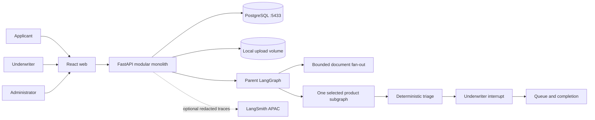

# UnderwriteFlow architecture

## Ownership boundaries

- PostgreSQL is the business source of truth for cases, versions, reviews,
  queues, completion records, and immutable audit events.
- LangGraph checkpoints make processing resumable. They do not replace audit
  events or determine authorization.
- Backend Python owns product rules, workflow state, persistence, provider
  behavior, and authorization.
- React owns presentation, interaction state, accessibility, and typed API
  consumption. It does not reproduce underwriting rules.
- Gemini and Ollama are provider adapters. The fake provider owns normal tests
  and deterministic smoke checks.

## Trust boundary

Uploaded documents are untrusted data. Extraction receives a separate trusted
system instruction and a serialized document payload. Stored audit and trace
views contain metadata and evidence locators, not credentials or raw files.

## Routing precedence

Deterministic rules outrank model suggestions. The applied order is
unsupported/manual, needs information, specialist, standard, expedited. Only
`expedited`, `standard`, and `specialist` are final routes; `manual` and
`needs_information` are review states, and a manual recommendation resolves to
the most cautious final route once an underwriter decides.

Normal intake cannot produce an unsupported product. A case is pinned to a
version that was validated when it was imported, and the case carries no
independent product code, so the pinned configuration always describes a
supported product. The `unsupported_product` state the triage graph reads as
tier one is set when the pinned version's stored configuration can no longer be
read. That routes the case to manual review with the reason recorded as a
validation, instead of failing the request. Any future intake path that accepts
a product the rulebook does not cover must set the same state.

## Evidence and failure signals

Documents are extracted through a bounded fan-out of at most three branches per
case. A branch that cannot be read does not fail the whole case: it reports a
typed failure carrying the document id, the filename, and the error code.
Collected failures are a specialist signal, applied after the existing
specialist signals and before the `standard` rule so an earlier factor is never
displaced. A sibling branch's evidence still reconciles, so the gap is reported
next to whatever was recovered rather than replacing it.

Uploads are checked against the content types the pinned configuration accepts
for that document code. The check runs after the magic-byte check and before
the file reaches the upload volume, so a rejected upload is never stored.

Confidence is treated cautiously: a reconciled field whose confidence is
missing or non-numeric counts as low confidence, because an unreadable
confidence is not evidence of agreement.

## Pinned configuration for one case

`GET /api/v1/cases/{case_id}/configuration` serves the configuration pinned
when processing started, resolved against the submitted application, together
with the document requirements resolved to a `required` flag per code. It is
guarded by case ownership and the read permission, and it resolves only through
the case's pinned version.

The product catalogue describes what a new application may choose. It is never
the source of truth for an existing case: a case pinned to version 1 keeps
reading version 1 after version 2 is activated. `CaseResponse` stays compact,
carrying identity and pinned versions only, so list endpoints do not ship
configuration blobs.

If the pinned version or rulebook is missing, or the stored configuration can
no longer be validated, the endpoint returns 409 instead of a partial
configuration. The review endpoints tolerate the same condition by opening the
case with no derived requirements and no selectable specialist labels.

## Governance boundary

The workflow produces only `expedited`, `standard`, or `specialist` triage
recommendations. It pauses before final routing. Only an authenticated
underwriter can confirm or override that recommendation. A decision that routes
a case to specialist must name a label from the case's pinned configuration; a
missing or unknown label is refused, and a `manual` outcome resolves to
`specialist` rather than becoming a fourth route.
