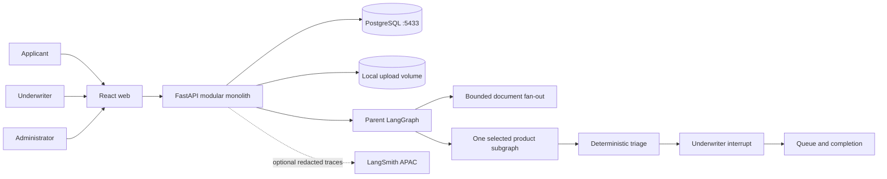

# UnderwriteFlow architecture

## Ownership boundaries

- PostgreSQL is the business source of truth for cases, versions, reviews,
  queues, completion records, and immutable audit events.
- LangGraph checkpoints make processing resumable. They do not replace audit
  events or determine authorization.
- Backend Python owns product rules, workflow state, persistence, provider
  behavior, and authorization.
- React owns presentation, interaction state, accessibility, and typed API
  consumption. It does not reproduce underwriting rules.
- Gemini and Ollama are provider adapters. The fake provider owns normal tests
  and deterministic smoke checks.

## Trust boundary

Uploaded documents are untrusted data. Extraction receives a separate trusted
system instruction and a serialized document payload. Stored audit and trace
views contain metadata and evidence locators, not credentials or raw files.

## Routing precedence

Deterministic rules outrank model suggestions. The applied order is
unsupported/manual, needs information, specialist, standard, expedited. Only
`expedited`, `standard`, and `specialist` are final routes; `manual` and
`needs_information` are review states, and a manual recommendation resolves to
the most cautious final route once an underwriter decides.

Normal intake cannot produce an unsupported product. A case is pinned to a
version that was validated when it was imported, and the case carries no
independent product code, so the pinned configuration always describes a
supported product. The `unsupported_product` state the triage graph reads as
tier one is set when the pinned version's stored configuration can no longer be
read. That routes the case to manual review with the reason recorded as a
validation, instead of failing the request. Any future intake path that accepts
a product the rulebook does not cover must set the same state.

## Evidence and failure signals

Documents are extracted through a bounded fan-out of at most three branches per
case. A branch that cannot be read does not fail the whole case: it reports a
typed failure carrying the document id, the filename, and the error code.
Collected failures are a specialist signal, applied after the existing
specialist signals and before the `standard` rule so an earlier factor is never
displaced. A sibling branch's evidence still reconciles, so the gap is reported
next to whatever was recovered rather than replacing it.

Uploads are checked against the content types the pinned configuration accepts
for that document code. The check runs after the magic-byte check and before
the file reaches the upload volume, so a rejected upload is never stored.

Confidence is treated cautiously: a reconciled field whose confidence is
missing or non-numeric counts as low confidence, because an unreadable
confidence is not evidence of agreement.

## Pinned configuration for one case

`GET /api/v1/cases/{case_id}/configuration` serves the configuration pinned
when processing started, resolved against the submitted application, together
with the document requirements resolved to a `required` flag per code. It is
guarded by case ownership and the read permission, and it resolves only through
the case's pinned version.

The product catalogue describes what a new application may choose. It is never
the source of truth for an existing case: a case pinned to version 1 keeps
reading version 1 after version 2 is activated. `CaseResponse` stays compact,
carrying identity and pinned versions only, so list endpoints do not ship
configuration blobs.

If the pinned version or rulebook is missing, or the stored configuration can
no longer be validated, the endpoint returns 409 instead of a partial
configuration. The review endpoints tolerate the same condition by opening the
case with no derived requirements and no selectable specialist labels.

## Governance boundary

The workflow produces only `expedited`, `standard`, or `specialist` triage
recommendations. It pauses before final routing. Only an authenticated
underwriter can confirm or override that recommendation. A decision that routes
a case to specialist must name a label from the case's pinned configuration; a
missing or unknown label is refused, and a `manual` outcome resolves to
`specialist` rather than becoming a fourth route.

## Dynamic authorization

Authorization is database-backed, not hard-coded. Roles own permission sets,
users hold exactly one role in this MVP, and every secured route depends on a
resolved scope such as `cases:override`, `schemas:edit`, `review:write`, or
`audit:read`. Access tokens are issued with an issuer and audience and a short
TTL; refresh credentials are stored as digests, rotate on every use, and record
revocation and replacement links. A claim carried by a token never widens
access on its own: the current role and scope set are read per request, so a
disabled user or a re-assigned role takes effect immediately. A change that
would leave no active holder of `users:manage` is refused.

## Configured evidence reconciliation

Reconciliation checks are configuration, not code. Each check is declared in
the pinned product version as one of `ncb_match`, `asset_match`, or
`policy_lapse`, names the application field and the document code it reads, and
is validated at import and activation so a check cannot reference a field or
document that does not exist. The checks run as a pure step after the document
fan-out and join: no database, provider, file, log, audit, or routing work.
Results are ordered deterministically by check code, comparison field key, and
document id plus locator, and each result is exactly `CLEARED`,
`FLAGGED_DISCREPANCY`, or `MISSING_EVIDENCE`.

A flagged discrepancy is a deterministic specialist signal and is recorded with
its provenance. Missing document evidence keeps the case in the needs
information queue, which is a queue state and never a fourth triage route. A
check whose only missing input is an optional claim the applicant never made
does not apply, so it cannot decide the queue state on its own.

## Audit trail and privacy

Every business decision appends an immutable event: `audit_events` carries a
database trigger that rejects both update and delete. Events record identity,
pinned product and rulebook version identifiers with their content hashes,
document identifiers and content hashes, evidence provenance as field names
with document id and locator, the automated recommendation, configured
validation codes, risk signal codes, and the recorded human rationale. Each
processing cycle records one entry per document branch with the provider name,
the model, the attempt count, prompt and completion token counts or an explicit
unavailable marker, the hash of the request the adapter actually sent, and the
canonical hash of the validated result. A later cycle, review decision, or
configuration activation records the identifier of the event it supersedes, so
a reader can follow the effective decision instead of only the newest one.

What never reaches an event is as important as what does. The builder drops
secret-shaped keys (`password`, `token`, `credential`, `authorization`,
`api_key`, `session`, and similar) at every nesting level, drops any key that
would carry raw prompt or document text (`content`, `text`, `prompt`, `pages`,
`message`, and similar), bounds every free-text value, collection, and nesting
depth, and coerces non-finite numbers. Token counts are the one deliberate
exception to the token-shaped rule and are named explicitly. Extracted values
are represented by locators and hashes rather than copied text. On the external
Gemini path the recorded request hash is computed after the configured Aadhaar,
PAN, email, and phone redaction, so it identifies the redacted payload that
actually left the process.

Audit history is served read-only, is scoped by `audit:read`, and supports an
event-type filter and a bounded limit. No mutation route exists on the audit
surface: the only supported removal path is the operator cleanup used by
integration tests, which disables the append-only guard for that transaction.

## Journey and configuration authoring

A case's journey (new business or renewal) is chosen before product
selection and is fixed for that case. The pinned configuration is filtered
by journey: a renewal-only requirement, such as a prior-policy document,
never applies to a new-business case and vice versa. Administrators build,
preview, import, and explicitly activate versioned rulebooks; only an
activated version is visible to applicants, and activation never rewrites an
existing case's pinned version.

## Isolated end-to-end evaluation

`compose.evaluation.yaml` runs the full reference dataset against its own
tmpfs-backed PostgreSQL, bootstrap, API, and runner containers, with no
published ports and no volume or network shared with the development stack.
`make evaluate-e2e` tears down stale containers first, brings the stack up
detached, runs the evaluation as a separate one-shot container so its exit
code reflects only pass/fail, then tears down without deleting named
volumes. The result artifact is deterministic across repeated runs except
for elapsed time.

## Known limits

- Local-first and single-node: one FastAPI service, one web application, one
  PostgreSQL instance, and one upload volume. There is no queue broker,
  scheduler, or object storage, and the probe timings are local synthetic
  numbers rather than a capacity claim.
- Synthetic only: every applicant, document, product rule, specialist label,
  and evaluation label is fictional demonstration data. No real insurer,
  applicant, medical, financial, or vehicle data is present, and the routing
  rules are not genuine Indian underwriting guidance.
- Providers are optional: Gemini is the configured default and Ollama is behind
  a Compose profile, but both are disabled in normal verification. Only the
  deterministic fake provider participates in tests, smoke, and the probe, so
  provider latency and quota behavior are untested here.
- One role per user, one active version per product, and one recommendation per
  case. Multi-role assignment, version rollback, and concurrent active
  processing of a single case are out of scope.
- Document intake covers digital PDF text plus local OCR for scanned PDF, JPEG,
  and PNG at demonstration scale. Upload count, size, and page bounds are
  configuration constants, not tuned production limits.
- Tracing stays off by default and is development-only, redacted, and
  synthetic-data-only when enabled. No retention or deletion policy is
  implemented beyond the append-only guarantee, and the development reset
  procedure deletes project volumes.
