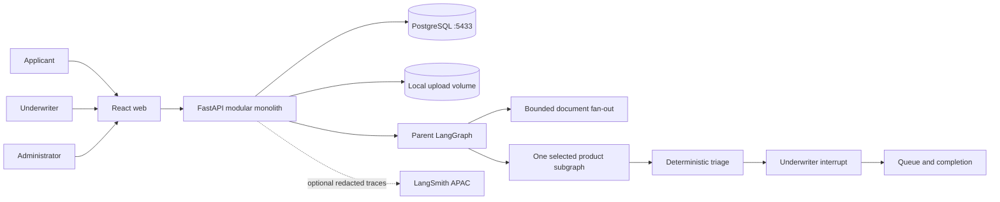

# UnderwriteFlow architecture

## Ownership boundaries

- PostgreSQL is the business source of truth for cases, versions, reviews,
  queues, completion records, and immutable audit events.
- LangGraph checkpoints make processing resumable. They do not replace audit
  events or determine authorization.
- Backend Python owns product rules, workflow state, persistence, provider
  behavior, and authorization.
- React owns presentation, interaction state, accessibility, and typed API
  consumption. It does not reproduce underwriting rules.
- Gemini and Ollama are provider adapters. The fake provider owns normal tests
  and deterministic smoke checks.

## Trust boundary

Uploaded documents are untrusted data. Extraction receives a separate trusted
system instruction and a serialized document payload. Stored audit and trace
views contain metadata and evidence locators, not credentials or raw files.

## Governance boundary

The workflow produces only `expedited`, `standard`, or `specialist` triage
recommendations. It pauses before final routing. Only an authenticated
underwriter can confirm or override that recommendation.
